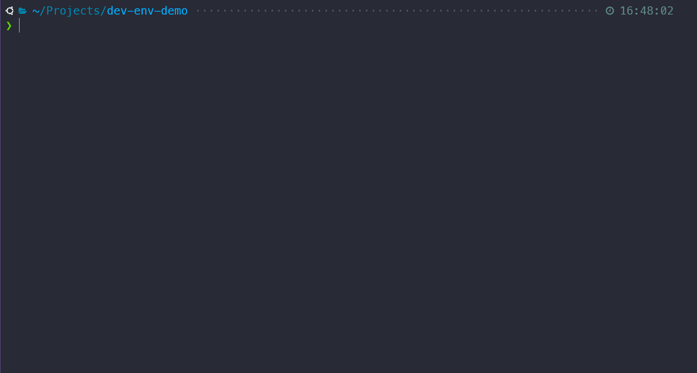

# Dev Environment Manager

[](https://codecov.io/gh/aftdev/dev-env-manager)

Command line tools and shortcuts to help make your development life easier.

Dev Environment Manager executes your most utilized commands and takes the
guesswork out of remembering long strings of commonly used development commands.



---

<!-- TOC -->

- [Installation](#installation)
- [Usage: default commands](#usage-default-commands)
  - [init](#init)
  - [setup](#setup)
  - [start and stop](#start-and-stop)
  - [connect](#connect)
  - [Scripts auto-discovery](#scripts-auto-discovery)
- [Custom commands](#custom-commands)
  - [Services that can be used by your custom commands](#services-that-can-be-used-by-your-custom-commands)
- [Configuration](#configuration)

<!-- /TOC -->

---

We can define where our commands are executed (locally or inside our Docker
containers). For example, if we'd like all of our Composer (PHP) scripts to be
executed inside a specific Docker container, we add this configuration inside
`dev-env-config.yml`:

```yaml
executables:
  composer:
    use:
      target: docker-compose
      with: ['exec', '<container_name>']
```

Now, we can simply run:

```bash
dev composer install
```

Behind the scenes, Dev Environment Manager runs:

```bash
docker composer exec <container_name> composer install
```

🎉

Day-to-day and custom developer commands can be easily defined via the
[commands directory](#configuration).

## Installation

```bash
npm install -g @aftdev/dev-env-manager
```

This installs `dev` globally.

```
dev --help
```

**Note/TODO:** `dev` may already be in use by your system or another npm
package. In this case, there would be a naming collision in the case of `dev`.

Future versions of Dev Environment Manager may change `dev` to something else
and _without notice_.

## Usage: default commands

Run these commands from the root of your project.

### `init`

```bash
dev init
```

Generates the `dev-env-config.yml` [configuration file](#configuration). Add
your configurations and customizations inside this file.

### `setup`

```bash
dev setup
```

Sets up the develop environment. Useful for getting started quickly inside a
freshly cloned project.

This command will execute:

- `docker compose build` && `docker compose up -d` (if a `docker-compose.yml`
  exists inside the project)
- `composer install` (if a `composer.json` exists inside the project)
- `npm install` (if a `package.json` exists inside the project)

**Note**: Your project will most likely require a different setup mechanism, you
can easily override this command if needed.
[See custom commands section](#custom-commands).

### `start` and `stop`

```bash
dev [start|stop]
# or
dev [up|down]
```

Starts or stops Docker containers. This is basically a shortcut for
`docker-compose [up|down]`

### `connect`

Uses your project's `docker-compose.yml` file to return list of currently
running containers. Select a container in order to open an SSH connection to it.

```bash
dev connect

Select a container to connect to:
- app1
- app2
- app3
- mysql
- redis

# Or, SSH directly to a specific container
dev connect app1

# SSH as root
$ dev connect app1 --root
```

### Scripts auto-discovery

Sometimes typing `dev composer <script-name>` can be repetitive. Dev Environment
Manager will auto-discover scripts from your package managers for you.

For example, using Composer and `composer.json`:

```json
{
  ...
  "scripts": {
    "test": "phpunit",
    "other-script": "do something else"
  },
  ...
}
```

Using `yarn` and `package.json`:

```json
{
  ...
  "scripts": {
    "build": "yarn build",
    "test": "mocha",
  ...
}
```

Now we can run:

```bash
dev other-script # will execute `dev composer other-script`
dev build # will execute `dev yarn build`
```

Enable auto discovery by adding the following in your `dev-env-config.yml` file:

```yaml
# @file ./dev-env-config.yml
package_managers:
  node:
    autodiscover: true
  composer:
    autodiscover: true
    priority: 200
```

**Note:** If the same script exists in both files, like `test` in the example, a
prompt will be displayed asking you to pick which manager to use.

```bash
❯ dev test
? Select which package manager to use: (Use arrow keys)
  Composer
  Npm
```

You can change the order of that list by using the `priority` configuration for
each manager.

**_Important:_** Commands registered at the application level (such as via
Commander) will always take precedence over `scripts` commands. For example, if
you created a custom `build` command Dev Environment Manager will always run the
custom command and not `yarn build`.

## Custom commands

Each project can set its own custom commands:

1. Set the command folder path in the `dev-env-config.yml` file
2. Add command files to the commands directory

Project commands will always take precedence over application default commands.

```yaml
# @file ./dev-env-config.yml
commands_dirs: ./commands
# or array notation
commands_dirs:
  - ./commands
  - ./another_folder
# or object notation (this makes it easier to override)
commands_dirs:
  default: ./commands
  other: ./another_folder
```

```js
// @file ./commands/my-command.js

export default (cli) => {
  cli
    .command('your-command-name')
    .description('This is my really cool command')
    .action(() => {
      console.log('HELLO')
    })
}
```

**Note**: If you want to use an NPM package from your project, the package will
need to be added to that project's `package.json` file.

**Important**: please use the **`.mjs`** extension if your project's
`package.json` is not setup as `type: "module"` (or if you do not have a
`package.json` file).

### Services that can be used by your custom commands

- `dockerCompose`: execute a command on a container
- `composer`: execute composer scripts
- `node`: execute npm, yarn or pnpm commands (depending on the configuration)
- `outputFormatter`: helpers to style output
- `commandExecuter`: execute commands

The above services are automatically injected into your command "module".

Example:

```js
export default (cli, dockerCompose, outputFormatter, composer) => {
  cli.command('auto-injection').action(() => {
    outputFormatter.title('Auto Injection example')

    const containers = dockerCompose.getContainers()
    console.log(containers)

    composer.execute(['install'])
  })
}
```

## Configuration

Configuration values are set inside the `dev-env-config.yml` file.

```yaml
# Where to find the project's custom commands (.js/.cjs/.mjs)?
# use array notation or object notation for easy overriding data.
commands_dirs: {}
# Package manager configuration
package_managers:
  node:
    # Which Node package manager to use (Npm / Yarn / Pnpm)
    manager: 'npm',
    # Auto discover scripts from these package manager files
    auto_discover: true,
    # Priority in case of script name collision with other managers
    priority: 1
  composer:
    auto_discover: true
    priority: 1
# How and where to run your project executables
executables:
  # Simple format
  docker-compose: docker compose
  # With target
  composer:
    # Where should the command be executed?
    use:
      target: docker-compose
      with: ['exec', 'php']
```
